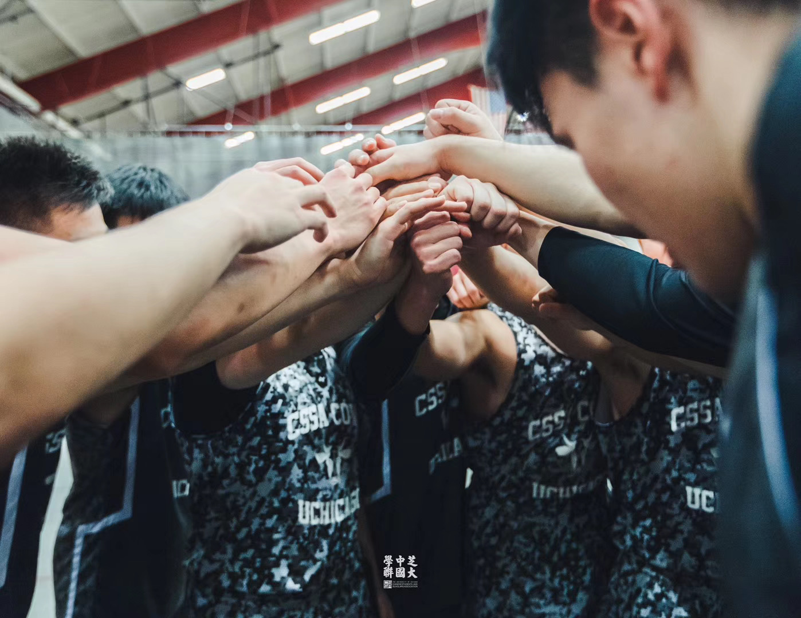

# hw01

# Self-Introduction
### Basic Information
Hi, my name is Shuo Qiu, a third-year college student majoring in Sociology. Sociology is interesting to me because it can explain collective phenomenon that a study of only individuals cannot.  

### Hobbies
Besides the academic intersts, I have several hobbies:

* Play piano
  + my favorite song is *The Silver Clouds Chasing the Moon*
* Play basketball
  + I built a basketball team in my second year and played in the intramurals. Here is a photo I took with my teammates in the Crown Gym before a game:

* Currently, I am re-watching all seasons of ***Friends*** on **Netflix** in my spare time, here is the
<Friends> [link](https://www.netflix.com/sg/title/70153404)

### Comment on hw01
It is not so challenging in forking the repo, downloading the clone, and editing the readme.md.  
At first, I am not very used to writing in Markdown format, even with the help of the cheatsheet. I still don't know how to resize the photo, ajust the position of texts, or adjust the font; these features  are easier to use in GUI workflow. Nevertheless, I start to realize the benefit of using RMarkdown -- it is simple to reproduce. I would love to learn more about R Markdown technique.
